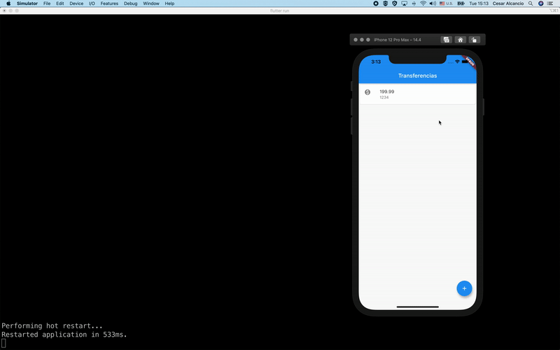

# Flutter Byte Bank

A new Flutter project, it was created using the `flutter create flutter_bytebank` command.

## Emulators

* The command `flutter emulators` list the emulators available.
* The command `flutter emulators --launch emulator-id` runs the emulator.

**For example**

```shell
❯ flutter emulators
2 available emulators:

apple_ios_simulator • iOS Simulator   • Apple  • ios
Nexus_5X_API_28     • Nexus 5X API 28 • Google • android

To run an emulator, run 'flutter emulators --launch <emulator id>'.
To create a new emulator, run 'flutter emulators --create [--name xyz]'.

You can find more information on managing emulators at the links below:
  https://developer.android.com/studio/run/managing-avds
  https://developer.android.com/studio/command-line/avdmanager
  

❯ flutter emulators --launch apple_ios_simulator
```

## Version

```shell
❯ flutter --version
Flutter 2.2.1 • channel unknown • unknown source
Framework • revision 02c026b03c (6 months ago) • 2021-05-27 12:24:44 -0700
Engine • revision 0fdb562ac8
Tools • Dart 2.13.1
```

## The Byte Bank App


## Getting Started

This project is a starting point for a Flutter application.

A few resources to get you started if this is your first Flutter project:

- [Lab: Write your first Flutter app](https://flutter.dev/docs/get-started/codelab)
- [Cookbook: Useful Flutter samples](https://flutter.dev/docs/cookbook)

For help getting started with Flutter, view our
[online documentation](https://flutter.dev/docs), which offers tutorials,
samples, guidance on mobile development, and a full API reference.
